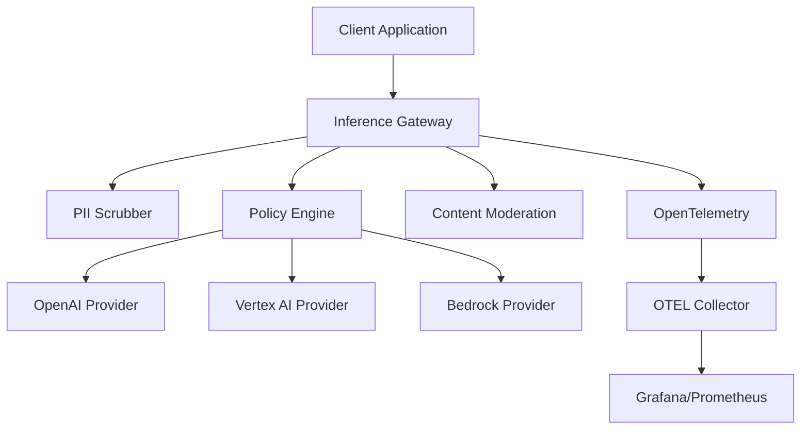

# AIVO Inference Gateway (S2-01)

**Multi-provider AI inference service with PII scrubbing and intelligent routing**

## Overview

The AIVO Inference Gateway is a unified API service that provides seamless access to multiple AI providers (OpenAI, Google Vertex AI, AWS Bedrock) with enterprise-grade features:

- **Multi-Provider Support**: OpenAI (default), Vertex AI Gemini, AWS Bedrock Anthropic
- **PII Scrubbing**: Automatic detection and masking of personally identifiable information
- **Intelligent Routing**: Policy-based provider selection with failover and load balancing
- **Content Moderation**: Safety checks with configurable thresholds
- **Streaming Support**: Real-time streaming responses for generation APIs
- **Cost Tracking**: Per-request cost calculation and usage monitoring
- **Observability**: OpenTelemetry tracing and structured logging

## Features

### 🤖 Multi-Provider Inference

- **Text Generation**: Chat completions and text completions
- **Embeddings**: Vector embeddings for semantic search and similarity
- **Content Moderation**: Safety and policy compliance checking
- **Model Mapping**: Automatic translation between provider model names

### 🔒 Security & Privacy

- **PII Detection**: Email, phone, SSN, credit cards, names, addresses
- **Content Scrubbing**: Configurable masking, hashing, or removal modes
- **Moderation Gates**: Block harmful content before processing
- **Request Isolation**: Per-tenant routing and cost allocation

### 🎯 Intelligent Routing

- **Policy Engine**: Subject/locale/SLA-based provider selection
- **Failover Logic**: Automatic fallback on provider failures
- **Circuit Breaker**: Temporary provider isolation on repeated failures
- **Cost Optimization**: Route to lowest-cost providers when appropriate

### 📊 Observability

- **OpenTelemetry**: Distributed tracing across all components
- **Health Checks**: Provider health monitoring with status endpoints
- **Metrics**: Latency, cost, success rates, PII detection counts
- **Structured Logs**: Request tracing with correlation IDs

## Quick Start

### Prerequisites

- Python 3.11+
- Docker & Docker Compose
- OpenAI API key (required)
- Optional: Google Cloud credentials, AWS credentials

### Environment Setup

```bash
# Required: OpenAI provider
export OPENAI_API_KEY="your-openai-api-key"

# Optional: Enable Vertex AI
export ENABLE_VERTEX=true
export VERTEX_PROJECT="your-gcp-project"
export VERTEX_LOCATION="us-central1"
export VERTEX_SERVICE_ACCOUNT_PATH="/path/to/service-account.json"

# Optional: Enable Bedrock
export ENABLE_BEDROCK=true
export AWS_ACCESS_KEY_ID="your-aws-access-key"
export AWS_SECRET_ACCESS_KEY="your-aws-secret-key"
export AWS_REGION="us-east-1"

# PII Configuration
export PII_SCRUB_MODE="mask"  # mask, hash, remove
```

### Run with Docker Compose

```bash
cd services/inference-gateway-svc
docker-compose up -d
```

Service will be available at `http://localhost:8020`

### Run Locally

```bash
cd services/inference-gateway-svc
pip install -r requirements.txt
python -m uvicorn app.main:app --host 0.0.0.0 --port 8000
```

## API Usage

### Chat Completions (OpenAI-compatible)

```bash
curl -X POST http://localhost:8020/v1/generate/chat/completions \
  -H "Content-Type: application/json" \
  -H "X-Request-ID: test-123" \
  -d '{
    "messages": [
      {"role": "user", "content": "Hello, my email is john@example.com"}
    ],
    "model": "gpt-4o",
    "max_tokens": 100,
    "temperature": 0.7,
    "subject": "enterprise/customer1",
    "scrub_pii": true,
    "moderate_content": true
  }'
```

### Streaming Completions

```bash
curl -X POST http://localhost:8020/v1/generate/chat/completions \
  -H "Content-Type: application/json" \
  -d '{
    "messages": [{"role": "user", "content": "Write a poem about AI"}],
    "model": "gpt-4o",
    "stream": true,
    "subject": "research/project1"
  }'
```

### Embeddings

```bash
curl -X POST http://localhost:8020/v1/embeddings \
  -H "Content-Type: application/json" \
  -d '{
    "input": ["Hello world", "Goodbye world"],
    "model": "text-embedding-3-large",
    "scrub_pii": true
  }'
```

### Content Moderation

```bash
curl -X POST http://localhost:8020/v1/moderations \
  -H "Content-Type: application/json" \
  -d '{
    "input": "This is some text to check for safety"
  }'
```

## Configuration

### Provider Configuration

```yaml
# Environment variables for providers
OPENAI_API_KEY: Required for OpenAI provider
OPENAI_BASE_URL: Override OpenAI endpoint (default: https://api.openai.com/v1)
OPENAI_TIMEOUT: Request timeout in seconds (default: 60)

ENABLE_VERTEX: Set to "true" to enable Vertex AI provider
VERTEX_PROJECT: Google Cloud project ID
VERTEX_LOCATION: Vertex AI location (default: us-central1)

ENABLE_BEDROCK: Set to "true" to enable Bedrock provider
AWS_ACCESS_KEY_ID: AWS access key
AWS_SECRET_ACCESS_KEY: AWS secret key
AWS_REGION: AWS region (default: us-east-1)
```

### Routing Policies

The policy engine supports complex routing rules:

```python
{
  "routing_policies": [
    {
      "subject_pattern": "enterprise/*",
      "preferred_providers": ["openai", "vertex_gemini"],
      "fallback_providers": ["bedrock_anthropic"],
      "strategy": "least_latency",
      "sla_tiers": ["premium", "enterprise"],
      "cost_limit_usd": 10.0
    },
    {
      "subject_pattern": "research/*",
      "preferred_providers": ["vertex_gemini", "bedrock_anthropic"],
      "fallback_providers": ["openai"],
      "strategy": "lowest_cost"
    }
  ]
}
```

### PII Scrubbing Configuration

```python
{
  "scrub_mode": "mask",  # mask, hash, remove
  "enabled_types": [
    "email", "phone", "ssn", "credit_card",
    "ip_address", "name", "address"
  ]
}
```

## Architecture



### Component Overview

- **FastAPI Router**: RESTful API endpoints with request validation
- **Provider Abstraction**: Unified interface for different AI services
- **Policy Engine**: Intelligent routing with failover and circuit breakers
- **PII Scrubber**: Regex and ML-based PII detection and masking
- **Content Moderation**: Safety checks with configurable thresholds
- **OpenTelemetry**: Distributed tracing and metrics collection

## Provider Support

| Feature         | OpenAI | Vertex AI | Bedrock |
| --------------- | ------ | --------- | ------- |
| Text Generation | ✅     | ✅        | ✅      |
| Streaming       | ✅     | ✅        | ✅      |
| Embeddings      | ✅     | ✅        | ✅      |
| Moderation      | ✅     | ❌\*      | ❌\*    |
| Cost Tracking   | ✅     | ✅        | ✅      |

\*Conservative fallback moderation used

## Monitoring & Health

### Health Check

```bash
curl http://localhost:8020/health
```

### Provider Status

```bash
curl http://localhost:8020/providers
```

### Metrics

```bash
curl http://localhost:8020/metrics
```

## Development

### Run Tests

```bash
pip install pytest pytest-asyncio pytest-mock
python -m pytest test_inference_gateway.py -v
```

### Local Development

```bash
# Install dependencies
pip install -r requirements.txt

# Run with auto-reload
uvicorn app.main:app --reload --host 0.0.0.0 --port 8000
```

### Building

```bash
docker build -t aivo-inference-gateway:latest .
```

## Security Considerations

- **API Keys**: Store provider API keys securely using environment variables
- **PII Handling**: PII scrubbing is enabled by default but can be disabled per request
- **Content Safety**: Moderation gates prevent harmful content from being processed
- **Network Security**: Use HTTPS in production with proper TLS certificates
- **Rate Limiting**: Implement rate limiting at the load balancer level

## Performance

### Benchmarks

- **P50 Latency**: ~200ms for short completions (excluding provider latency)
- **P99 Latency**: ~800ms for complex requests with PII scrubbing
- **Throughput**: 100+ concurrent requests (limited by provider quotas)
- **Memory**: ~100MB baseline + ~10MB per concurrent request

### Optimization Tips

- Use streaming for long-form generation
- Batch embedding requests when possible
- Configure appropriate provider timeouts for your SLA requirements
- Enable provider failover for high availability

## Changelog

### v2.0.1 (S2-01)

- ✅ Multi-provider inference (OpenAI, Vertex AI, Bedrock)
- ✅ PII detection and scrubbing with 10+ PII types
- ✅ Policy-based provider routing with failover
- ✅ Content moderation with safety thresholds
- ✅ Streaming generation support
- ✅ OpenTelemetry observability
- ✅ Cost tracking and usage metrics
- ✅ Docker containerization
- ✅ Comprehensive test suite

## Support

For issues and questions:

- Create an issue in the repository
- Review the test suite for usage examples
- Check the `/health` and `/metrics` endpoints for debugging

## License

See LICENSE file in the repository root.
